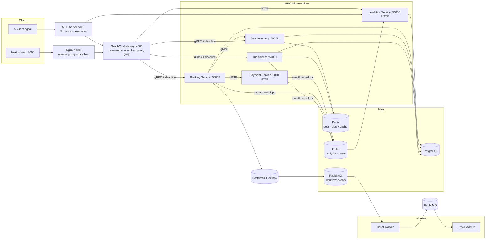
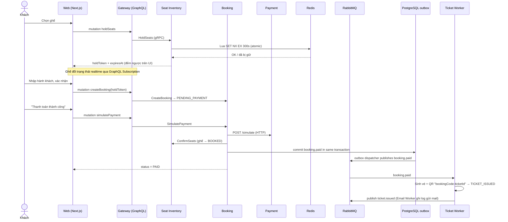
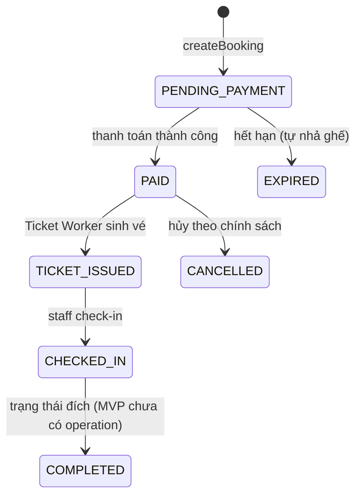

# TỔNG QUAN ĐỒ ÁN — AI Bus Booking System

Tài liệu duy nhất giúp cả team hiểu **đúng và đủ** về đồ án: hệ thống đặt vé xe khách liên tỉnh tích hợp AI, xây dựng theo kiến trúc microservices đúng yêu cầu giảng viên (`docs/LECTURER_REQUIREMENTS.md`).

## 1. Hệ thống làm được gì

- **Khách (guest/đăng ký):** tìm chuyến (autocomplete, lọc, sắp xếp, gợi ý ngày), xem sơ đồ ghế, giữ ghế 5 phút (Redis TTL), đặt vé, thanh toán mô phỏng, nhận vé điện tử có QR, tra cứu bằng mã booking + email, xem lịch sử, hủy vé.
- **Admin:** CRUD tuyến/bến/xe/chuyến, khóa ghế, xem booking theo chuyến, dashboard doanh thu, event logs.
- **Staff:** chỉ check-in hành khách (phân quyền riêng).
- **AI:** chatbot tư vấn chuyến/chính sách/tra booking (AI SDK tool calling) + MCP Server cho AI client bên ngoài.

## 2. Kiến trúc tổng thể



Nguyên tắc: **client chỉ nói chuyện với Gateway** (1 endpoint GraphQL); service nói chuyện nội bộ bằng **gRPC có deadline**; không service nào đọc database của service khác để ghi (Analytics chỉ đọc-join phục vụ báo cáo).

## 3. Luồng đặt vé end-to-end



## 4. State machine booking (Booking Service sở hữu)



Trạng thái ghế: `AVAILABLE → HELD (Redis TTL) → BOOKED`, admin có thể `BLOCKED`. Hai người giành 1 ghế → chỉ 1 người thắng (Lua atomic + `FOR UPDATE`).

## 5. Hai đường sự kiện (đừng nhầm lẫn)

| | RabbitMQ (workflow) | Kafka (analytics) |
|---|---|---|
| Mục đích | Điều phối nghiệp vụ phải xảy ra | Ghi nhận sự kiện để phân tích |
| Sự kiện | `booking.paid`, `ticket.issued`, `booking.expired` | `search-events`, `booking-events`, `payment-events`, `checkin-events` |
| Consumer | Ticket Worker, Email Worker, Seat consumer | Analytics Service |
| Envelope | `{eventId, eventName, payload, occurredAt}` | như nhau |
| Chống trùng | ack/nack theo message | **idempotency**: bảng `processed_events` theo `eventId` |

## 6. Bản đồ Module giảng viên ↔ code

| Module | Nội dung | Code chính |
|---|---|---|
| 1. Tìm kiếm & danh mục | search, autocomplete, lọc/sort, SEO, cache, gợi ý ngày | `services/trip-service`, `apps/web/app/search`, `apps/web/app/trips/[tripId]` |
| 2. Ghế & giữ chỗ realtime | seat map, hold TTL, subscription, race-safe | `services/seat-inventory-service`, `apps/web/src/components/SeatMap.jsx`, gateway pubsub |
| 3. Đặt vé & thanh toán & vé | state machine, payment mô phỏng, e-ticket, email log | `services/booking-service`, `services/payment-service`, `workers/ticket-worker`, `workers/email-worker` |
| 4. Quản trị | phân quyền ADMIN/STAFF, CRUD, check-in, block ghế, logs | `apps/web/app/admin/**`, gateway `adminResolvers`, trip `adminCatalog` |
| 5. Analytics, AI, MCP | Kafka consumer + dashboard, chatbot tool calling, MCP | `services/analytics-service`, `apps/web/app/api/chatbot`, `services/mcp-server` |

## 7. Lý thuyết từng tuần được áp dụng ở đâu

| Tuần | Lý thuyết | Áp dụng trong đồ án |
|---|---|---|
| 01 GraphQL | schema, resolver, subscription, 1 endpoint | `graphql/schema.graphql`, gateway resolvers + WS subscription |
| 02 gRPC | proto3, unary RPC, **deadline**, error codes | `proto/*.proto`, `gateway/src/grpc/call.js` (deadline 5s → `SERVICE_TIMEOUT`) |
| 03 Microservices p1 | API Gateway pattern, database-per-service, timeout khi gọi service | Gateway là điểm vào duy nhất; mỗi service tự quản dữ liệu của mình |
| 04 Microservices p2 | event-driven, envelope (eventId/occurredAt), **idempotent consumer** | `packages/shared/src/events.js`, `analytics: processed_events` |
| 06 Microservices p3 | Redis cache, Nginx reverse proxy + **rate limit**, JWT stateless | trip search cache, `infrastructure/nginx/nginx.conf` (10r/s/IP), gateway JWT |
| 07 Deploy & Testing | AAA unit test, integration, E2E, Docker Compose | `node --test` toàn bộ service, Playwright E2E, `docker-compose.yml` |
| 08 NextJS | App Router, Server vs Client Component, SEO metadata, mã lỗi UI | `apps/web/app/**`, `generateMetadata` trang chuyến, `_PrintTicketButton.jsx` |
| 09 AI integration | AI SDK tool calling, guardrails, MCP tools/resources | chatbot route (không bịa dữ liệu, bắt buộc code+email), `services/mcp-server` |

## 8. Kiểm thử

| Loại | Lệnh | Phạm vi |
|---|---|---|
| Unit (120+) | `npm run test:unit` | shared, readiness, web, gateway, booking, payment, trip, analytics, seat, MCP, ticket/email workers |
| Race condition | `npm run test:seat:race` | 2 client giành 1 ghế → 1 thắng |
| Integration | `npm run test:gateway:integration`, `test:seat:integration`, `test:analytics:integration` | gRPC/Redis/Kafka thật |
| E2E (Playwright) | `npm run test:web:e2e` | luồng khách đặt vé + admin/staff + phân quyền |
| Hiệu năng | `npm run test:gateway:perf` | JMeter benchmark gateway |

## 9. Chạy hệ thống & quy trình làm việc

```bash
npm install && npm run dev:all   # infra Docker + services, READY sau health checks
```

Chi tiết demo cho giảng viên: `demo/HUONG_DAN_DEMO.md`. Setup đầy đủ: `docs/README_SETUP.md`.

Quy trình git: nhánh `main` ổn định, làm việc trên nhánh `<member>/<scope>`, commit `feat|fix|test|docs(scope): mô tả`, PR vào `main`. **Không bao giờ commit** `.env`, API key, mật khẩu, dữ liệu thật (`docs/CODING_GUIDELINES.md`).

Nguồn sự thật hợp đồng (contract): đổi GraphQL/gRPC/DB/event/MCP **phải** cập nhật đồng thời `graphql/schema.graphql`, `proto/*.proto`, `database/schema.sql`, `docs/API_CONTRACT.md`, `docs/DATABASE_SCHEMA.md`.
